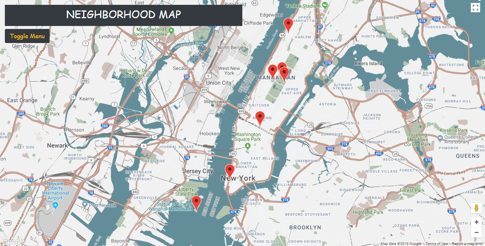
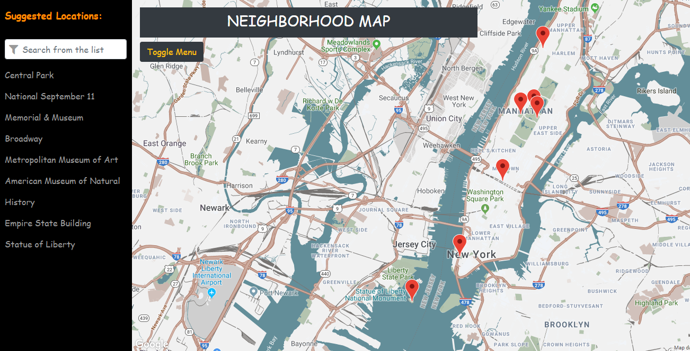

# Neighborhood Map
## Project Overview
>  A single page application featuring a map of your neighborhood or a neighborhood you would like to visit. Functionality of this map including highlighted locations, third-party data about those locations and various ways to browse the content.

### Features:
1. This helps user to find Any place in the map by just writing the name of the place in the textfield.
2. After that a marker will appear on that place if the place is appropriate one.
3. User can also see the **Name** and the **Wikipedia Relevant Links** of that place after clicking on that marker.

## How to Run? :traffic_light:
### Pre Requirements!
* [Google Chrome Browser](https://www.google.com/chrome/) Latest Version or your any Favourite Browser
* Proper Internet Connection
* [Knockout JS v3.4.2](https://knockoutjs.com/) (Pre-Installed in Repository - Required Proper Inrernet Connection)
* Bootstrap (Pre-Installed in Repository - Required Proper Inrernet Connection)

### Setup the Project:
1.  Download or Clone [Neighborhood Map Application](https://github.com/FixEight/udacity-neighborhood-map.git) repository.
6. You will need to unzip repository after downloading it or open it after cloning.

## Run the Project: :rocket:
Inside **udacity-neighborhood-map** directory open the `index.html` using your favourite browser.

## Expected Output in Browser: :camel:
> Front View of the Application

> SideBar View of the Application

## License
Neighborhood Map Application is Copyright :copyright: 2018 Kashif Iqbal. It is free, and may be redistributed under the terms specified in the [LICENSE](https://choosealicense.com/licenses/mit/#) file.